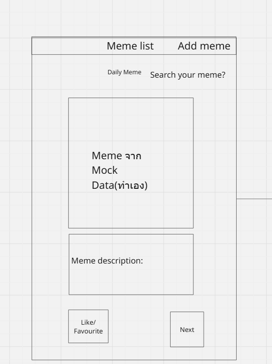
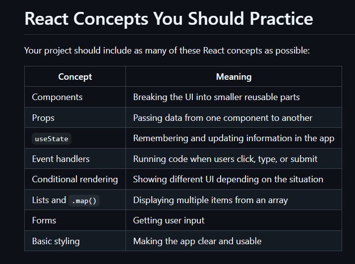
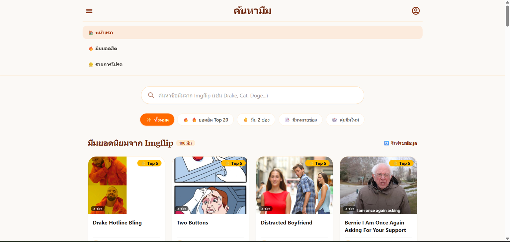

# Read and understand
อยากจะให้นายอ่าน Source Code ทั้งหมด แล้วสร้างappโดยเป็น Landing-page.jsx
เอาสี โครง และ template เป็นแบบเดียวกับ Home.jsx
แล้วสร้าง function ในการสุ่มMeme ดังนี้
1. ตรงกลาง จะเป็นรูปมีมใหญ่ๆ
2. มีปุ่มว่าชอบ 
3. และปุ่มถัดไป โดยปุ่มถัดไปจะทำการสุ่ม Meme ตามapi ที่เรารับมา 
4. ตกแต่งด้วยtailwindcssได้ 

โดยที่นายสามารถใช้ React component ตามรูปนี้ได้เลย

นี่คือ theme ที่ฉันคาดหวัง

เมื่อเสร็จ ให้เชื่อมกับ home.jsx แล้ว rename เป็น memecatergory.jsx พอได้ทุกย่างให้ทำการเอาทุกอย่างเชื่อมกัน

สิ่งที่ฉันคาดหวัง 
1. สลับหน้า landing page และ memecategory page ได้
2. โค๊ดมีความเข้าใจง่าย อ่านง่าย ไม่ทำ code ขยะ
3. ทำให้ตัวนาย(AI) สามารถแก้ไข Code ได้ง่ายเมื่อิเกิดการเปลี่ยนแปลง
4. theme เหมือนกันทุกอย่าง 
5. Interaction ครบ เช่น ปุ่มมี Hover 